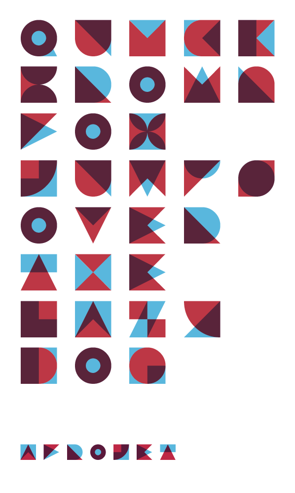

brutal exchange of a snug for some faith
======

Modular and multilayered type design with CSS

I wanted to try some playful experiments that incorporated webfonts and CSS shenanigans. For this experiment, I wanted to create a webfont built from modular and geometric shapes (squares, triangles, half-circles, etc.) with the goal that one could layer the shapes on top of each other to produce recognizable (albeit abstract) letterforms. Additionally, I wanted to be able to gives the shapes color and a specific opacity so that layered together the letterforms would produce three distinct colors. AND, I wanted this presented in a screen-readable format so the text could be selectable and indexable.

To achieve the result above, I stated by building a font that consisted of specific geometric shapes assigned to the uppercase characters (A-Z) and the lowercase characters (a-z). Again, the idea being-when the uppercase is layered on top of the lowercase (or vise versa), a recognizable letterform is established. Of course, if both the top layer and the bottom layer are the same color, then the effect doesn’t translate as well. It was important that different colors could be given to the uppercase characters and the lowercase characters. To make the effect more striking, it was crucial that the top layer’s opacity be adjustable as well.

Download the Web font here: http://www.afrojet.com/fonts/brutal.zip

Consists of four formats: .eot, .svg, .ttf and .woff.